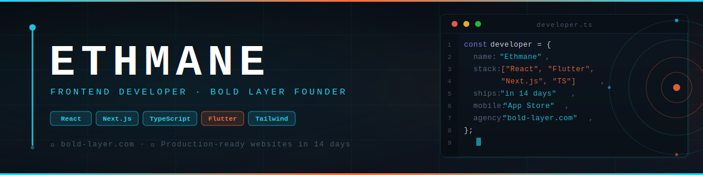

  

<h1 align="center">
  
</h1>

  
  &nbsp;
  
  &nbsp;
  
  &nbsp;
  

---

## About Me

I spent years in professional kitchens cooking under pressure — timing, precision, and no room for mistakes. In 2024 I graduated from **Noroff School of Technology** and brought that same mindset to frontend development. Today I run **[Bold Layer](https://www.bold-layer.com)**, a freelance web agency that ships high-performance, production-ready websites in 14 days for startups and small businesses. Originally from Mauritania, based in Norway — I speak 4 languages, meditate daily, and believe the best code, like the best food, is clean, intentional, and made to last.

---

## 🚀 Featured Projects

<table>
  <tr>
    <td width="50%" valign="top">
      <h3><a href="[LINK]">[PROJECT NAME]</a></h3>
      
[Brief description — what it does, who it's for, and the result it delivers. Stack: React / Next.js / TailwindCSS]

    </td>
    <td width="50%" valign="top">
      <h3><a href="[LINK]">[PROJECT NAME]</a></h3>
      
[Brief description — what it does, who it's for, and the result it delivers. Stack: TypeScript / Node.js / Firebase]

    </td>
  </tr>
  <tr>
    <td width="50%" valign="top">
      <h3><a href="[LINK]">[PROJECT NAME]</a></h3>
      
[Brief description — what it does, who it's for, and the result it delivers. Stack: Next.js / Vercel / REST API]

    </td>
    <td width="50%" valign="top">
      <h3><a href="[LINK]">[PROJECT NAME]</a></h3>
      
[Brief description — what it does, who it's for, and the result it delivers. Stack: React / Redux / Express]

    </td>
  </tr>
</table>

---

## 🛠️ Tech Stack

**Frontend**

**Backend & Auth**

**Tools & Deployment**

**Currently Learning**

---

## 📊 GitHub Stats

  
  &nbsp;
  

  

  

---

## 💼 Work With Me

> **[Bold Layer](https://www.bold-layer.com)** — complete, production-ready websites in **14 days**, not 14 weeks.

| | Service | What You Get |
|---|---|---|
| 🎨 | **Custom Design** | Unique, brand-aligned UI — no templates, ever |
| 📱 | **Mobile-Optimized** | Pixel-perfect across every screen size |
| ⚡ | **Performance-First** | Fast load times, clean code, Lighthouse 90+ |
| 🔍 | **SEO-Ready** | Meta tags, structured data, fully crawlable |
| 🚀 | **14-Day Delivery** | Live site, on time — or we talk |
| 🛠️ | **Post-Launch Support** | Handoff docs + 30 days of fixes included |

  
  &nbsp;
  

---

## 📬 Let's Connect

  
  &nbsp;
  
  &nbsp;
  
  &nbsp;
  

---

  <em>"In the kitchen, a recipe is just the beginning — what matters is execution under pressure. 
  Code is no different. I build things that work when it counts."</em>  
  — Ethmane · Chef turned Developer · Mauritania → Norway

